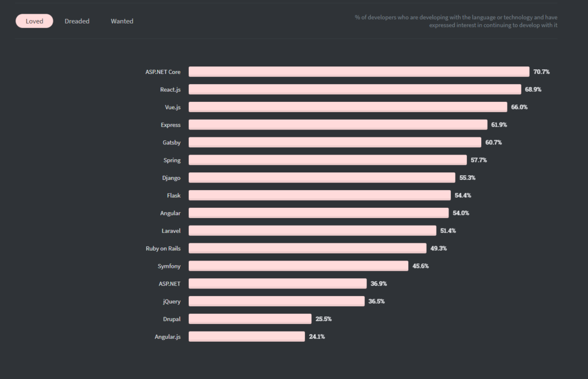

# Pesquisa linguagens de programação para Back-end 

## **1. OBJETIVOS**

Esta pesquisa tem como objetivo encontrar uma boa linguagem de programação e frameworks para o desenvolvimento BACK-END do site/app

## Pré-requisitos
### **1. Linguagens e seus Framworks**
- 1.1 Python
- 1.2 JavaScript
- 1.3 C#
- 1.4 Java
- 1.5 Ruby
- 1.6 PHP
- 1.7 GO
### **2. Prós e contras de cada um**
### **2. Conclusão**
### **3. Referências**
---
## **1. LINGUAGENS E SEUS FRAMEWORKS**
### **1.1 Python**
*Django*  
Se você precisa construir um site, especialmente se for particularmente complexo, você pode optar pelo Django. É uma estrutura da Web baseada em Python focada na construção de sites complexos e orientados a banco de dados. Se ter um site de alto desempenho é uma prioridade para você, então você deve optar pelo Django.
* Vantagens de usar o Django

  - Django é conhecido por ser muito escalável. Em particular, seu recurso de reutilização de código torna mais fácil para os desenvolvedores se ajustarem ao aumento do tráfego no site.
  - O Django é orientado para SEO, o que significa que os sites baseados nele são mais fáceis de otimizar e tornar o SEO amigável. Uma das principais razões para isso é que você pode manter aplicativos baseados em Django em servidores por meio de URLs em vez de endereços IP.
  - Sendo um framework de backend muito popular, o Django pode contar com uma grande comunidade pronta para fornecer suporte a todos que exploram a ferramenta.
  - Orientado para sem código: Django NÃO É um framework sem código, mas possui alguns recursos sem código; existem pacotes que o desenvolvedor pode utilizar sem usar nenhum código.
  - Versatilidade: como mencionado, o Django é particularmente adequado para sites baseados em banco de dados, mas, dito isso, é muito versátil. Você pode usá-lo para criar qualquer tipo de site.

*Flask*  
Estrutura de back-end baseada em Python: é o Flask. Flask é, em particular, um framework WSGI: ele roda o servidor web ao invés do navegador do usuário. Muitos aplicativos da Web modernos são executados no Flask porque permite que eles criem projetos muito personalizados que funcionam sem problemas.
* Vantagens de usar o Flask

  - Com o Flask, você recebe um servidor de desenvolvimento web embutido: facilita a depuração e permite que os desenvolvedores implementem código Python no navegador quando ocorrerem erros com a solicitação.
  - Sendo baseado em Python, o FLask permite que você desenvolva seu aplicativo rapidamente. Python é conhecido por exigir menos codificação do que outras linguagens de programação de desenvolvimento.
  - Com o Flask, você pode configurar facilmente servidores web.
  - Curva de aprendizagem rápida: Flask não é conhecido por ser fácil de aprender; a comunidade em torno do Flask é tão grande que você pode encontrar toneladas de documentação e tutoriais. Muita documentação vem dos próprios desenvolvedores do Flask. Mesmo os iniciantes podem aprender rapidamente.

OBS: - Se você está criando um site baseado em banco de dados , o Django é um dos melhores frameworks de desenvolvimento web para este propósito.
    - Qualquer desenvolvedor familiarizado com a linguagem de programação Python pode facilmente usar o Flask. Além disso, se você precisa se concentrar no desenvolvimento da Web do lado do servidor, o Flask é a estrutura de back-end ideal.

### **1.2 JavaScript**
*Express.JS*  
Express.js é uma estrutura de aplicativo da Web Node.js. Assim como o AppMaster, ele visa criar aplicativos da web e aplicativos móveis, mas não é uma plataforma sem código, portanto, se você não estiver familiarizado com linguagens de programação de desenvolvimento, sua escolha ainda deve recair no AppMaster. Entre os desenvolvedores experientes, no entanto, o Express.js é um framework de back-end muito popular e tem sido usado para criar aplicativos da web famosos como MySpace e Uber.
* Vantagens de usar o Express.js

  - Muitos recursos padrão do Node.js estão disponíveis para facilitar o trabalho do desenvolvedor;
  - Express oferece alguns modelos que ajudam você a criar páginas da web
  - A depuração é facilitada no Express.js porque é mais fácil identificar as partes precisas do código que contêm bugs;
  - Express.js é uma estrutura muito escalável; como mencionamos, a escalabilidade permite que você permaneça com o mesmo framework que seu projeto e as necessidades crescem;
  - Como o Express.js é uma estrutura de back-end muito popular, os desenvolvedores podem contar com uma grande comunidade para apoiar o trabalho uns dos outros e fornecer ajuda quando necessário;
  - Com o Express.js, você usa a mesma linguagem de programação (JavaScript) para desenvolvimento web de front-end e back-end.

*Next.js*  
Em seguida, o.js se enquadra na categoria de estruturas minimalistas. É uma estrutura Node.js de código aberto usada para aplicativos React renderizados pelo servidor. Um pouco atrás do Express.js, o Next.js tem cerca de 1,8 milhão de downloads de aplicativos por semana. Com presença em cerca de 2,7 mil pilhas, o Next.js tem a confiança de mais de 800 empresas, presentes em todo o mundo. Os desenvolvedores que visam criar aplicativos interativos junto com recursos amigáveis ​​​​ao SEO geralmente escolhem o Next.js.

Next.js autoriza competências de aplicativos da web baseados em reação, como renderização do lado do servidor e geração de página estática. O Next.js também cria aplicativos híbridos com otimização estática automática.
* Vantagens de usar o Next.js
  - Otimização de imagem
  - Totalmente extensível
  - Desenvolvimento mais rápido
  - Documentação Detalhada
  - CSS integrado
  - páginas híbridas
  - Ótima API de roteamento baseado em página
  - Divisão Automática de Código

*Koa.js*  
Koa.js é outra estrutura de código aberto com a pilha de tecnologia de back-end. É um framework Node.js mínimo e extremamente flexível que tem cerca de 1 milhão de downloads por semana. Além disso, está presente em mais de 200 stacks e tem a confiança de cerca de 90 empresas. Ele está repleto de recursos que promovem uma construção contínua de aplicativos Web e móveis. Os criadores de Express.js e KOA.js são os mesmos.
* Vantagens de usar o Koa.js
  - Sem middleware
  - É flexível e leve, o que o ajuda a ter uma pegada pequena. No entanto, pode-se usar plugins para uma ampla variedade de módulos
  - Ser leve e flexível também ajuda o Koa.js a se desenvolver mais rapidamente.
  - O recurso de tratamento de erros simplifica a tarefa de tratamento de bugs e facilita a tarefa dos desenvolvedores
  - Construído sobre as tecnologias mais recentes e avançadas, o Koa.js será relevante por um período mais longo, tornando-o uma estrutura contemporânea.

*Hapi.js*  
Hapi.js é uma estrutura Node.js de código aberto que ajuda os desenvolvedores a criar aplicativos da Web sem falhas e escaláveis. Com 400 mil downloads por semana, o Hapi.js é usado por cerca de 76 organizações espalhadas pelo mundo. É uma estrutura adequada, perfeita para desenvolver sites, servidores de API e aplicativos de proxy HTTP.
Ele é alimentado por incríveis módulos integrados e outros recursos.

* Vantagens de usar o Hapi.js

  - js é extremamente seguro, pois cada linha de código é verificada minuciosamente
  - A presença de vários plugins oficiais o torna um rico ecossistema.
  - Implementação fácil e direta
  - previsibilidade
  - interface simples

OBS: - Se você está muito familiarizado com JavaScript, mas se sente inseguro com outras linguagens de programação, o Express.js pode ser a estrutura de back-end perfeita para você.
    - O Express.js é alimentado por recursos muito sofisticados, como roteamento detalhado, configuração, recursos de segurança, mecanismos de depuração etc. Portanto, a estrutura do Express.js é adequada para aplicativos da web de nível empresarial.
    - Apesar de terem sido desenvolvidos pelos mesmos desenvolvedores, Koa.js e Express.js possuem alguns recursos distintos. Por exemplo, o Express.js oferece um recurso de 'nó de aumento'; por outro lado, o Koa.js oferece 'consertar e substituir o nó'.
    - Os recursos extras do Express.js, como roteamento e modelagem, estão ausentes no Koa.js.
    - Koa.js é perfeito para quem quer eliminar callbacks.
    - Se você tiver uma equipe de desenvolvedores React.js, poderá usar rapidamente o Next.js para criar aplicativos responsivos e de alta demanda. Possui uma ampla gama de tecnologias web que facilitam aos usuários a construção de aplicações robustas, rápidas e interativas.  
### **1.3 C sharp**
*ASP.Net*  
ASP.NET é uma estrutura de desenvolvimento de código aberto usada para criar aplicativos .NET. Ele usa código C# e é a estrutura da Web ideal se sua prioridade for fornecer uma experiência de usuário positiva para seus usuários.
* Vantagens de usar o ASP.NET Core

  - É altamente especializado
  - Ele usa JavaScript, que é uma das linguagens de programação mais populares

OBS: - Se você precisa criar aplicativos móveis ou da Web e garantir uma experiência tranquila para seus usuários do Windows, o ASP.NET Code é a arquitetura ideal para trabalhar.

### **1.4 Java**
*Spring*  
Spring é um framework de desenvolvimento web que usa Java. Ele tem sido usado para criar muitos sites muito populares e de alto funcionamento, como o Wix, uma plataforma complexa de criação de sites.
* Vantagens de usar o Spring

  - Sendo baseado em Java, uma linguagem de programação muito popular, o Spring é muito popular e pode contar com uma ampla comunidade para suporte;
  - Ele vem com muitos projetos irmãos que podem impulsionar as performances do Spring
  - O Spring é muito escalável, especialmente graças aos projetos paralelos que o acompanham.

OBS: - Se você estiver familiarizado com Java, a estrutura de desenvolvimento da Web Spring pode ser adequada para você

### **1.5 Ruby**
*Ruby on Rails*  
Ruby on Rails é um framework de desenvolvimento web baseado na linguagem de programação Ruby. Também é de código aberto. Ruby não é a linguagem de programação mais popular, mas Ruby on Rails é uma estrutura de back-end muito popular porque ajuda os desenvolvedores durante o processo de programação, fornecendo simplicidade, testes automatizados e bibliotecas.
* Vantagens de usar Ruby on Rails

  - Ruby on Rails executa testes automatizados no código que os desenvolvedores escrevem. Isso ajuda a economizar toneladas de tempo!
  - Ruby on Rails também é muito versátil e flexível. Ele permite aos desenvolvedores controle total sobre seus projetos: eles podem decidir como o banco de dados do aplicativo deve funcionar. Em seguida, o framework criaria o código automaticamente e de acordo com as instruções dos desenvolvedores. Novamente, esta é uma maneira de tornar as coisas mais fáceis e rápidas.
  - Ruby on Rails fornece muitas bibliotecas onde os desenvolvedores podem encontrar qualquer ferramenta que precisem para construir seus bancos de dados.

OBS: - Iniciantes podem aprender Ruby on Rails com muita facilidade. Por esta razão, este tipo de framework de desenvolvimento web é considerado adequado para aprendizes ou iniciantes

### **1.6 PHP**
*Laravel*  
Se você está procurando por um framework baseado em PHP, o Laravel é conhecido por ser a escolha ideal. É de código aberto e foi projetado especificamente para criar um aplicativo da Web baseado em Symfony que segue uma arquitetura MVC. Se você precisa se concentrar no desenvolvimento de back-end, os especialistas dizem que esta é sua estrutura de back-end ideal.
* Vantagens de usar o Laravel

  - O Laravel oferece muitos recursos de segurança. Ele também usa um algoritmo (o algoritmo de hash Bcrypt) para criar senhas que as tornam altamente seguras.
  - Modelos: com o Lavarel, você pode explorar vários modelos integrados para criar layouts e conteúdo.
  - Além do PHP, o Laravel fornece widgets com código CSS e JS
  - Ideal para criar projetos complexos
  - Um dos recursos mais importantes do Laravel é a presença da API simples que funciona com a biblioteca SwiftMailer.  

*Cake PHP*  
O CakePHP pode ser considerado uma alternativa ao Ruby on Rails para desenvolvedores PHP.
* Vantagens de usar o CakePHP

  - É adequado tanto para projetos simples, para iniciantes, quanto para projetos muito complexos
  - É altamente escalável
  - Traz as vantagens do Ruby on Rails para desenvolvedores PHP
  - Curva de aprendizado rápida

OBS: - Laravel não é adequado para iniciantes. Também é muito complexo se você precisar gerenciar um projeto simples ou pequeno. O Laravel é adequado apenas para desenvolvedores experientes, familiarizados com muitas linguagens de programação e como integrá-las, que precisam trabalhar em projetos complexos.
    - Se você estiver familiarizado com a linguagem de programação PHP, o CakePHP pode fornecer a arquitetura ideal para construir sua aplicação web em qualquer nível.

### **1.7 GO**
*Fiber*  
Fiber é a arquitetura de desenvolvimento do lado do servidor para desenvolvedores Go . Como você deve saber, Go é uma linguagem de programação de código aberto que pode ser usada para fins gerais e foi desenvolvida por engenheiros do Google.
* Vantagens de usar fibra

  - É uma estrutura enxuta, mas poderosa
  - Sendo enxuto, também é considerado altamente escalável
  - Ele pode ser facilmente integrado a bibliotecas de terceiros.

OBS: - Se você precisar criar um aplicativo da Web geral, poderá trabalhar sem problemas com o Fiber.

## **PRÓS E CONTRAS**
PRÓS  
Spring boot
- Oferecer uma experiência de início de projeto rápida e direta;
- Apresentar uma visão opinativa e flexível sobre o modo como os projetos Spring devem ser configurados;
- Fornecer requisitos não funcionais pré-configurados;
- Não prover geração de código e zerar a necessidade de arquivos XML.  

Express JS  
O Express.js é o rei dos downloads quando se trata do módulo Node.js de código aberto. Ele tem cerca de 18 milhões de downloads por semana e 20.000 pilhas, e tem a confiança de 1.733 empresas espalhadas pelo mundo. 

.NET  
Caso você precise de um aplicativo que funcione em várias plataformas, o .NET será a ótima escolha, pois a maioria das plataformas é coberta e você pode reduzir o esforço de desenvolvimento enquanto expande seu aplicativo de desktop ou móvel para outros sistemas operacionais. Além disso, o .NET pode ser usado para casos específicos de engenharia, como jogos (incluindo Xbox) e desenvolvimento de AR (incluindo HoloLens).
Ainda é um ponto discutível se o .NET foi projetado principalmente para uso corporativo. Mas a Microsoft garante o fornecimento do conjunto de ferramentas mais amplo possível para criar e integrar produtos corporativos, tanto internos quanto públicos. Ele também oferece suporte a um ecossistema robusto de mobilidade corporativa .

Ruby on rails  
Bom e muito utilizado para novas startups e em fase de crescimento
Menos linhas de código: quando Ruby é combinado com Rails, ele introduz muitas bibliotecas prontas para uso. Se o desenvolvedor executar um comando de terminal, um código esqueleto será incluído automaticamente. Agora, o desenvolvedor só precisa modificar o esqueleto de acordo com os requisitos e está pronto para funcionar, em vez de exigir que o código seja escrito do zero.

Estabilidade
- Django: Empresas como Disqus, Instagram, Pinterest e Mozilla têm usado Django por muito anos. Sites desenvolvidos em Django resistem a picos de tráfego de mais de 50 mil acessos por segundo. [Lista de sites que usam Django](https://djangosites.org/)

Ecalabilidade
- Django: Sim. Comparado com o tempo de desenvolvimento, hardware é barato, por isso, Django é projetado para aproveitar o máximo de hardware quanto você pode dar a ele.
- Node JS: Os aplicativos Node.js são facilmente escaláveis, vertical e horizontalmente. Enquanto a escala vertical permite adicionar mais recursos aos nós atuais, a escala horizontal permite adicionar novos nós mais rapidamente. Além disso, os aplicativos Node.js não requerem um grande bloco em todo o processo de desenvolvimento, pois funcionam em conjunto com uma série de microsserviços e módulos. É tão simples, fácil e se encaixa perfeitamente para startups que desejam crescer.

Alta performance
- Node JS: O Node.js é executado no mecanismo Google V8 JS. Isso significa que ele usa o mesmo compilador JavaScript/just-in-time do Google Chrome, ou seja: o código Javascript é compilado diretamente no código de máquina. Isso o torna eficiente em termos de recursos e também acelera a velocidade da estrutura.

Grandes empresas
- Django: Disqus - YouTube - Instagram - Spotify - Bitbucket - DropBox - Mozilla - Pinterest
- Node: LinkedIn - Netflix - IBM - Uber - Walmart - Paypal - Down Jones - GoDaddy - Amazon 
- Express JS: Fox Sports - Pay Pal - Uber - IBM - Twitter - Stack - Accenture
- ASP.net:  SpaceX - Roblox - Stack Overflow - Deezer - Slack - GrubHub
- Spring: Udemy - Trivago - Intuit - ifood - Mercado Livre - Rappi 
- Ruby on rails: Contração muscular - GitHub - Airbnb - Shopify - Bloomberg - Etsy

Quando é indicado
- Express JS: O Express.js é alimentado por recursos muito sofisticados, como roteamento detalhado, configuração, recursos de segurança, mecanismos de depuração etc. Portanto, a estrutura do Express.js é adequada para aplicativos da web de nível empresarial.

CONTRAS  
Onde Não deve ser usado
- Node JS: Existem poucos casos em que não é indicado utilizá-lo, como no caso de aplicativos web que exigem computação intensiva de CPU e uso pesado do lado do servidor: isso bloqueará a capacidade de resposta do Node.js.
- Laravel: Laravel não é adequado para iniciantes. Também é muito complexo se você precisar gerenciar um projeto simples ou pequeno. O Laravel é adequado apenas para desenvolvedores experientes, familiarizados com muitas linguagens de programação e como integrá-las, que precisam trabalhar em projetos complexos.
- Django: A estrutura do Django não é apropriada para projetos menores per se, porque parece ser um exagero com os enormes recursos e funções que o Django tem a oferecer. É simplesmente demais para projetos menores lidar e pode facilmente atrapalhar o desempenho do projeto devido ao tamanho e à natureza da estrutura.
- Ruby on rails: O tempo de inicialização do framework é bastante longo, especialmente quando você trabalha com um projeto massivo. Se você comparar o tempo de desempenho com outros frameworks como Node.js, com certeza verá a diferença. A documentação nem sempre está atualizada para RubyGems

## **4. CONCLUSÃO**

Um dos benefícios mais interessantes do C# é que ele pode ser implantado para criar qualquer tipo de aplicativo para várias plataformas, incluindo Windows, Console, Android nativo, IoT, bibliotecas reutilizáveis ​​e muito mais. O framework Django é uma solução perfeita para startups e grandes empresas. A escalabilidade é um dos melhores recursos do Django e permite que qualquer aplicativo lide com qualquer crescimento de volume de público com eficiência também. Enquanto Django é mais adequado para aplicações pesadas e complexas, o Flask é adequado para aplicativos web simples e leves.
Através da pesquisa foi notado que os frameworks mais usados pelos desenvolvedores são Django, ExpressJS e .NET, mesmo que os outros frameworks possuem um alto nível em resultados, esses três se destacam e ganham pontos em questões de escalabilidade, performance, desempenho e usabilidade.
O framework express.js por exemplo, possui cerca de 18 milhões de downloads por semana e 20.000 pilhas, e tem a confiança de 1.733 empresas espalhadas pelo mundo segundo a [ClarionTech](https://www.clariontech.com/blog/best-nodejs-frameworks) e o Django possui 1.808.297 downloads semanais segundo a [snyk](https://snyk.io/advisor/python/django)

Imagem do site [monocubed](https://www.monocubed.com/blog/most-popular-web-frameworks/)

Segundo o site [pangea](https://www.pangea.ai/web-development-resources/most-popular-backend-frameworks-for-teams/), os framwroks mais usados no ano de 2022 foram: express.js com 23% de uso por desenvolvedores, ASP.net core com 20%, Spring com 16% e Django com 13%

## **5. REFERÊNCIAS**

AppMaster: <https://appmaster.io/pt/blog/10-melhores-estruturas-de-back-end-da-web>  
Django: <https://docs.djangoproject.com/pt-br/4.1/faq/general/#:~:text=Empresas%20como%20Disqus%2C%20Instagram%2C%20Pinterest,50%20mil%20acessos%20por%20segundo.>  
Acervo lima: <https://acervolima.com/os-10-principais-aplicativos-django-e-por-que-as-empresas-os-estao-usando/>  
Blog: <https://blog.back4app.com/pt/startups-usando-c-sharp/>  
EzDevs: <https://ezdevs.com.br/o-mercado-de-c-e-net-e-seu-crescimento-nos-ultimos-anos/>  
Uds: <https://uds.com.br/blog/node-js-vantagens/>  
GeekHunter: <https://blog.geekhunter.com.br/tudo-o-que-voce-precisa-saber-sobre-o-spring-boot/>  
Clarion tech: <https://www.clariontech.com/blog/best-nodejs-frameworks>  
Hackernoon: <https://hackernoon.com/the-good-and-the-bad-of-net-framework-programming-6e3b5ccc03>  
Pangea: <https://www.pangea.ai/dev-ruby-development-resources/best-practices/>  
Sloboda studio: <https://sloboda-studio.com/blog/pros-and-cons-of-ruby-on-rails/>  
Pangea: <https://www.pangea.ai/web-development-resources/most-popular-backend-frameworks-for-teams/>  
